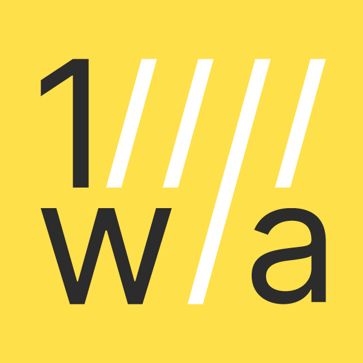

<h1 align="center">
  <br/>
  Create Go App CLI
</h1>
<p align="center">Set up a new Go (Golang) full stack app by running one CLI command!</p>

<p align="center">&nbsp;&nbsp;<a href="https://gocover.io/github.com/create-go-app/cli/pkg/cgapp" target="_blank"></a>&nbsp;<a href="https://goreportcard.com/report/github.com/create-go-app/cli" target="_blank"></a>&nbsp;</p>

<br/>

## ⚡️ Quick start

Let's create a new app into `./app` folder with [Fiber](https://github.com/gofiber/fiber) as backend and [Preact](https://github.com/preactjs/preact) as frontend:

```console
cgapp create -p ./app -b fiber -f preact
```

That's all you need to start! 😉

## ⚙️ Installation

First of all, [download](https://golang.org/dl/) and install Go. Version `1.11` or higher is required.

Installation is done using the [`go install`](https://golang.org/cmd/go/#hdr-Compile_and_install_packages_and_dependencies) command:

```console
go install -i github.com/create-go-app/cli
```

### ~ Alternative installations

We're using a [GoReleaser](https://github.com/goreleaser/goreleaser) project for shipping _standalone_ **Create Go App CLI** version to all major desktop platforms: _Apple macOS_, _GNU/Linux_, _MS Windows_. By default, for _amd64_ (x86_64) architecture.

If you need this version, please go to the repository [release page](https://github.com/create-go-app/cli/releases) and download zipped archive.

## 📚 Commands & Options

```console
cgapp [command] [command options] [arguments...]
```

> ☝️ **Tip** you can see all available commands by running command with `--help` (or `-h`) option.

### `create`

Creates a new Go app.

```console
cgapp create --help

NAME:
   cgapp create - create a new Go app

USAGE:
   cgapp create [command options] [arguments...]

OPTIONS:
   --path value, -p value       path to create app, ex. ~/projects/my-app (default: ".")
   --backend value, -b value    backend for your app, ex. Fiber, Echo (default: "net/http")
   --frontend value, -f value   frontend for your app, ex. Preact, React.js, React.ts (default: "none")
   --webserver value, -w value  web/proxy server for your app (default: "none")
   --database value, -d value   database for your app, ex. Postgres (default: "none")
   --help, -h                   show help
```

> 🔔 **Please note:** by default, `cgapp create` command without any options will create into current folder default backend (`net/http`) without frontend or configured Docker containers!

## 📝 Available production-ready app templates

**Golang:**

- `net/http` [create-go-app/net_http-go-template](https://github.com/create-go-app/net_http-go-template) — Backend template with built-in net/http ([pkg/net/http](https://golang.org/pkg/net/http/)).
- `fiber` [create-go-app/fiber-go-template](https://github.com/create-go-app/fiber-go-template) — Backend template with Fiber ([gofiber/fiber](https://github.com/gofiber/fiber)).
- `echo` _WIP_ [create-go-app/echo-go-template](https://github.com/create-go-app/echo-go-template) — Backend template with Echo ([labstack/echo](https://github.com/labstack/echo)).

**JavaScript:**

- `react-js` [create-go-app/react-js-template](https://github.com/create-go-app/react-js-template) — Frontend template with React.js ([facebook/react](https://github.com/facebook/react)).
- `react-ts` [create-go-app/react-ts-template](https://github.com/create-go-app/react-ts-template) — Frontend template with React.js TypeScript ([facebook/react](https://github.com/facebook/react)).
- `preact` [create-go-app/preact-js-template](https://github.com/create-go-app/preact-js-template) — Frontend template with Preact ([preactjs/preact](https://github.com/preactjs/preact)).

## 🐳 Available production-ready Docker containers

**Web/Proxy server:**

- `nginx` [create-go-app/nginx-docker](https://github.com/create-go-app/nginx-docker) — Docker container with Nginx.

**Database:**

- `postgres` _WIP_ [create-go-app/postgres-docker](https://github.com/create-go-app/postgres-docker) — Docker container with PostgreSQL.

## 👤 User templates & containers

Create Go App CLI provide creation your own template, instead of those prepared by authors. It's easy! 😉

Just specify backend (`-b`), frontend (`-f`), webserver (`-w`) and database (`-d`) with addresses to your repositories and run:

```console
cgapp create \
             -b github.com/user/my-back-template \
             -f gitlab.com/user/my-front-template \
             -w github.com/user/my-webserver-container-template \
             -d bitbucket.org/user/my-database-container-template
```

> 🔔 **Please note:** the `https://` protocol will add automatically!

## 🤔 FAQ

**How to update CLI to latest version?**

You can just reinstall the CLI. The latest version will be downloaded and installed automatically:

```console
go install -i github.com/create-go-app/cli
```

If you're using _standalone_ version, please go to the [release page](https://github.com/create-go-app/cli/releases) and download archive with a new version.

## ⭐️ Project assistance

If you want to say **thank you** or/and support active development `create-go-app/cli`:

1. Add a GitHub Star to project.
2. Twit about project [on your Twitter](https://twitter.com/intent/tweet?text=Set%20up%20a%20new%20Go%20%28Golang%29%20full%20stack%20app%20by%20running%20one%20CLI%20command%21%26url%3Dhttps%3A%2F%2Fgithub.com%2Fcreate-go-app%2Fcli).
3. Donate some money to project author via PayPal: [@paypal.me/koddr](https://paypal.me/koddr?locale.x=en_EN).
4. Join DigitalOcean at our [referral link](https://shrts.website/do/server) (your profit is **\$100** and we get \$25).
5. Buy awesome [domain name with **5%** discount](https://shrts.website/reg/domain) at REG.COM.

Thanks for your support! 😘 Together, we make this project better every day.

### ~ Sponsors

| Logo                                                                                                           | Description                                                                                                                                         | URL                              |
| -------------------------------------------------------------------------------------------------------------- | --------------------------------------------------------------------------------------------------------------------------------------------------- | -------------------------------- |
|  | **True web artisans** — Team who making UX efficiency review, friendly UI design, smart backend microservices, high-quality web apps and many more. | [https://1wa.co](https://1wa.co) |
|                                                                                                                | <div align="center">💡 <a href="mailto:truewebartisans@gmail.com">Want to become a sponsor too?</a></div>                                           |                                  |

## ⚠️ License

MIT &copy; [Vic Shóstak](https://github.com/koddr) & [True web artisans](https://1wa.co/).
