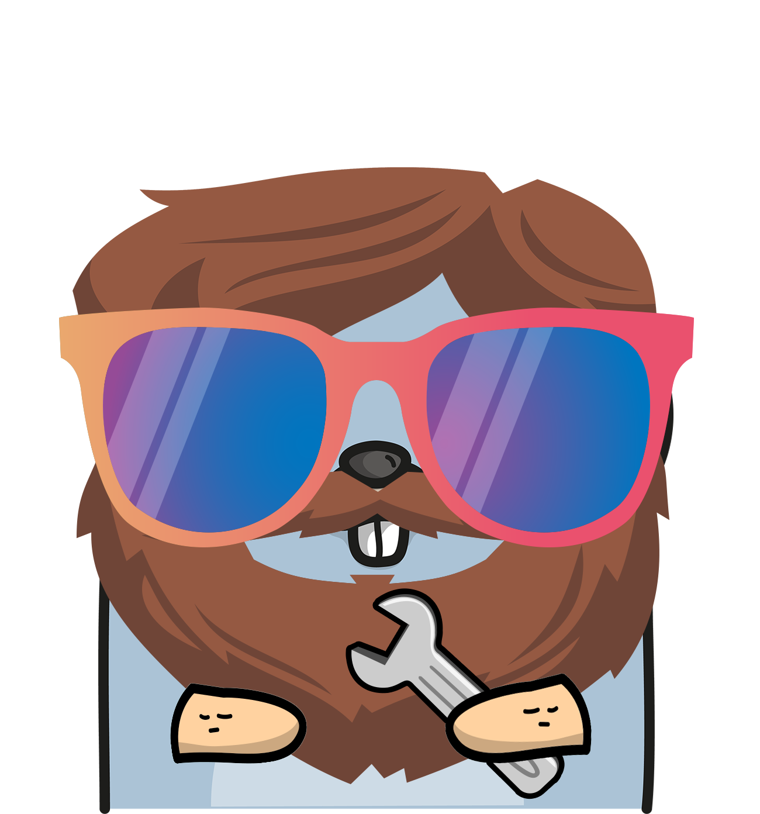

<h1 align="center">🕶 CLI for Create Go App</h1>
<h3 align="center">Set up a new Go (Golang) full stack app by running one CLI command!</h3>

## The Why?

Coming soon...

## Requirements

- Go `1.11+`
- Go Modules

## Developers

- Idea and active development by [Vic Shóstak](https://github.com/koddr) (aka Koddr).

## Project assistance

If you want to say «thank you» or/and support active development `create-go-app/cli`:

1. Add a GitHub Star to project.
2. Twit about project [on your Twitter](https://twitter.com/intent/tweet?text=Set%20up%20a%20new%20Go%20%28Golang%29%20full%20stack%20app%20by%20running%20one%20CLI%20command%21%26url%3Dhttps%3A%2F%2Fgithub.com%2Fcreate-go-app%2Fcli).
3. Donate some money to project author via PayPal: [@paypal.me/koddr](https://paypal.me/koddr?locale.x=en_EN).
4. Join DigitalOcean at our [referral link](https://m.do.co/c/b41859fa9b6e) (your profit is **\$100** and we get \$25).

Thanks for your support! 😘 Together, we make this project better every day.

### Sponsors

| Logo | Sponsor description | URL |
| ------------ | ------------- | ------------- |
|  | **True web artisans** — IT specialists around the world, who are ready to share their experience to solve your business objectives. | [https://1wa.co](https://1wa.co) |
|  | 
💡 <a href="mailto:truewebartisans@gmail.com">Want to become a sponsor too?</a>
 |  |

## License

MIT
